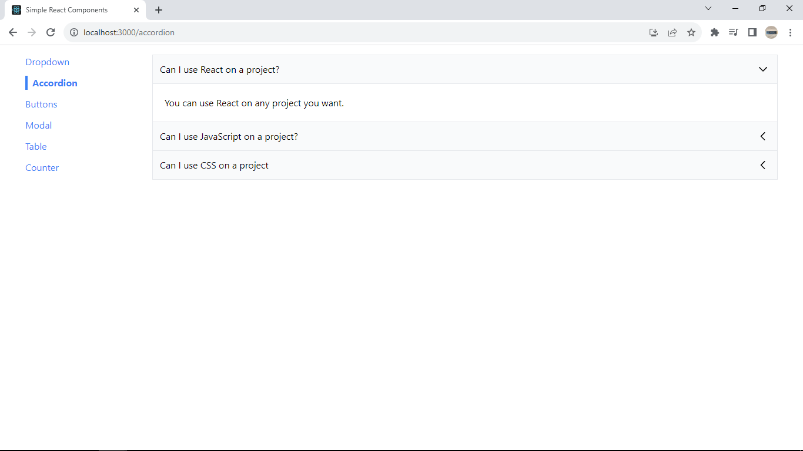
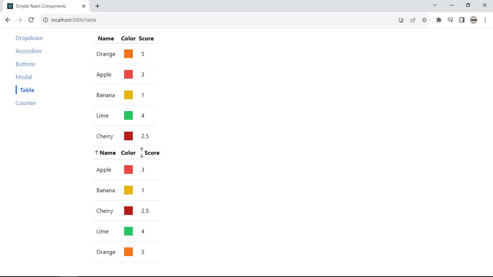

## Simple React Components

I made this project while taking [this online course](https://www.udemy.com/course/react-redux/) on React JS and Redux.

This application includes Single-Page Application **navigation, custom React hooks, Tailwind, Context API, reducers, and many reusable components**.

## Screenshots

### Accordion component

### Unsortable and sortable tables

## Installation

1. [Download the source code.](https://github.com/IhorAntiukhov/simple-react-components/archive/refs/heads/main.zip)
2. Install Node.js and NPM.
3. Open a terminal and navigate to the project's root directory.
4. Execute **npm install** and **npm start** command.
